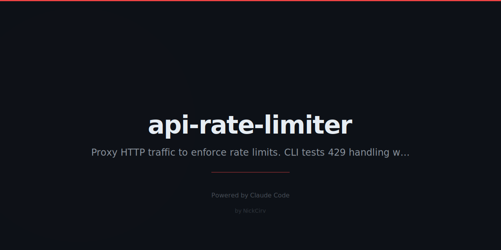

# api-rate-limiter

> Local HTTP proxy that adds rate limiting to any endpoint — test 429 handling without modifying your server.

Zero external dependencies. Pure Node.js ES modules. Node 18+.

---

## Install

```bash
npm install -g api-rate-limiter
# or
npx api-rate-limiter start ...
```

---

## Quick Start

```bash
# Limit your local server to 10 requests/min
api-rate-limiter start --port 3001 --target http://localhost:3000 --limit 10/min

# Short alias
rl start --port 3001 --target http://localhost:3000 --limit 10/min
```

All traffic to `:3001` is proxied to `:3000`, with 429 responses injected when the limit is exceeded.

---

## Commands

### `start` — Launch the proxy

```bash
api-rate-limiter start [options]
```

| Option | Description | Default |
|---|---|---|
| `--port <n>` | Proxy listen port | `3001` |
| `--target <url>` | Upstream URL to proxy | `http://localhost:3000` |
| `--limit <rate>` | Rate limit: `10/s`, `60/min`, `1000/hour` | `60/min` |
| `--per-ip` | Separate limit per client IP | global |
| `--per-path` | Separate limit per URL path | global |
| `--burst <n>` | Allow N extra requests on top of limit | none |
| `--delay <ms>` | Add artificial delay (`300ms`, `2s`) | none |
| `--error-rate <pct>` | Randomly fail N% of requests with 500 | none |
| `--config <file>` | Load config from JSON file | none |

### `stats` — View live counters

```bash
api-rate-limiter stats
```

Reads stats from the running proxy and prints them.

---

## Rate Limit Strategies

### Fixed window (default)

```bash
# 10 requests per minute, globally
rl start --target http://localhost:3000 --limit 10/min

# Per client IP
rl start --target http://localhost:3000 --limit 10/min --per-ip

# Per URL path
rl start --target http://localhost:3000 --limit 5/min --per-path
```

### Burst allowance

```bash
# Allow 10/min normally, but allow up to 20 in a burst
rl start --target http://localhost:3000 --limit 10/min --burst 10
```

### Sliding window approximation

The proxy uses a two-bucket sliding window approximation — more accurate than a simple fixed window, without the memory overhead of a full sliding log.

---

## Chaos / Latency Testing

```bash
# Add 500ms delay to every request (latency simulation)
rl start --target http://localhost:3000 --delay 500ms

# Randomly fail 10% of requests with 500
rl start --target http://localhost:3000 --error-rate 10

# Combine: rate limit + delay + chaos
rl start --target http://localhost:3000 --limit 20/min --delay 200ms --error-rate 5
```

---

## Config File

Save options in `rl.json`:

```json
{
  "port": 3001,
  "target": "http://localhost:3000",
  "limit": "10/min",
  "perIp": true,
  "burst": 5,
  "delay": "200ms",
  "errorRate": 5
}
```

```bash
rl start --config rl.json
```

CLI flags override file values.

---

## 429 Response Format

When the rate limit is exceeded:

```
HTTP/1.1 429 Too Many Requests
Retry-After: 42
X-RateLimit-Limit: 10
X-RateLimit-Remaining: 0
X-RateLimit-Reset: 1740000000

{
  "error": "Too Many Requests",
  "message": "Rate limit exceeded. Retry after 42s",
  "retryAfter": 42
}
```

---

## Real-Time Stats

The proxy renders a live dashboard in your terminal:

```
  api-rate-limiter v1.0.0
  ──────────────────────────────────────────
  Proxy:   3001 → http://localhost:3000
  Limit:   10/min (window: 60000ms) | burst: +5
  Mode:    per-IP | delay: 200ms | chaos: 5%
  ──────────────────────────────────────────
  Total:   847 requests | 23 rejected (2%)
  Window:  9 req in current window
  Buckets: 4 active keys
  Top paths:
       312  /api/users
       201  /api/posts
        94  /health
        72  /api/search
        41  /api/auth/login

  Press Ctrl+C to stop
```

---

## Use Cases

- Test your app's retry logic and 429 handling
- Simulate slow or unreliable upstream APIs
- Chaos engineering — inject random failures
- Reproduce rate limit bugs locally without hitting real API limits
- CI/CD testing of rate-limit-aware client code

---

## Requirements

- Node.js 18+
- Zero npm dependencies — only built-in modules (`http`, `https`, `net`, `url`, `crypto`, `fs`)

---

## License

MIT
